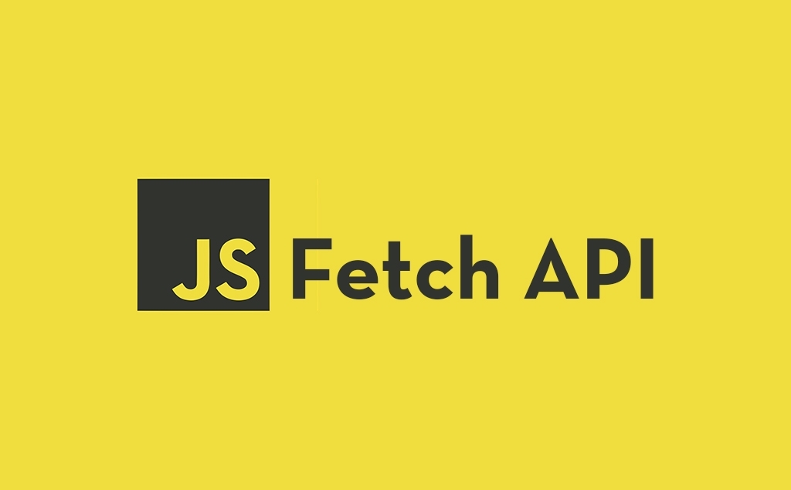

# Fetch with JS! 📬

<p align="center">
  <a href="https://github.com/jgome284/fetch-js">
    
  </a>
</p>
<h3 align="center">Foreword</h3>
<p align="center">
  GET and POST with HTTP requests through the JavaScript fetch api.
  <br>
  <a href="https://github.com/jgome284/fetch-js/issues">Report Bug</a>
  ·
  <a href="https://github.com/jgome284/fetch-js/issues">Request Feature</a>
</p>
<br>

## Table of Contents

- [Fetch with JS! 📬](#fetch-with-js-)
  - [Table of Contents](#table-of-contents)
  - [About](#about)
  - [Setup](#setup)
  - [Prerequisites](#prerequisites)
    - [Docker](#docker)
    - [VSCode](#vscode)
    - [API Keys](#api-keys)
  - [Getting Started](#getting-started)

## About

With JS, there's a lot you can `fetch()` through HTTP requests. In this project, several API endpoints are demoed in the [requests.ipynb](./requests.ipynb) notebook. You can try these for yourself to GET - pun intended - some cool data. (⌐■_■) ... Additionally, a **[Movie Finder App](./app/)** is offered to showcase the power of leveraging the [TMDB](https://www.themoviedb.org/) API to GET relevant data. 🍿🎥

## Setup

This project is setup with a Dev Container for use on Visual Studio Code. It serves as a full-featured development environment with everything needed to run JavaScript on the jupyter notebook. Dev Containers separate tools, libraries, or runtimes needed for working with a codebase. They aid in continuous integration and testing. Dev containers can be run locally or remotely, in a private or public cloud, in a variety of supporting tools and editors.

[This devcontainer](./.devcontainer/), is built IAW the [dev containers specification](https://containers.dev/implementors/spec/) and tailored for a build environment that leverages Ubuntu. Of note, the devcontainer has git for version control and several extensions installed for Visual Studio Code as development utilities for the IDE.

## Prerequisites

### Docker

To start, you need to have Docker Engine and Docker Compose on your machine. You can either:

- Install [Docker Desktop](https://www.docker.com/products/docker-desktop/) which includes both Docker Engine and Docker Compose. (Recommended ⭐)
- Install [Docker Engine](https://docs.docker.com/engine/install/binaries/) and [Docker Compose](https://docs.docker.com/compose/install/standalone/) as standalone binaries. (If it suits your fancy 🤵)

### VSCode

This devcontainer is setup for development on Visual Studio Code. You should have it installed along with the [remote development pack](https://marketplace.visualstudio.com/items?itemName=ms-vscode-remote.vscode-remote-extensionpack) to enable the IDE's devcontainers functionality.

### API Keys

You will have to get some API keys for this project to work locally. The following APIs are leveraged. Reference each link for more information. To generate API keys, you'll have to create an account with Rebrandly and TMDB.

- [Datamuse](https://www.datamuse.com/api/) --> No Key Required 🔓
- [Rebrandly](https://www.rebrandly.com/) --> Key Required 🔐
- [TMDB](https://www.themoviedb.org/) ------> Key Required 🔐

The [requests.ipynb](./requests.ipynb) notebook is setup to import the following secrets from a `./keys.js` file. Create this file for yourself in accordance with the format below.

```JavaScript
// keys.js
const rebrandly = "YOUR REBRANDLY API KEY"
const tmdb_rat = "YOUR TMDB RANDOM ACCESS TOKEN"
module.exports = {rebrandly, tmdb_rat} // node.js syntax
```

The [Movie Finder App](./app/) is setup to import a TMDB API Key from `./app/private/api.js`. Create this file for yourself in accordance with the format below.

```JavaScript
// api.js
const tmdb_api = "YOUR TMDB API KEY"
export {tmdb_api} // ES6 syntax
```

## Getting Started

To start, open VS Code in a directory of your choice. Open the terminal and clone this repository with `git clone https://github.com/jgome284/fetch-js`.

Open Docker Desktop to run the Docker daemon, a background process that manages and coordinates Docker containers on your system. On VS Code, start the development container by running `Dev Containers: Rebuild and Reopen In Container` in the command palette. It can be accessed with the keyboard shortcut `ctrl + shift + P` on your keyboard.

If successful, Visual Studio will establish a remote connection to the development container. When it does, feel free to look over the examples on [requests.ipynb](./fetch-js.ipynb)! Additionally, with the [live server](https://marketplace.visualstudio.com/items?itemName=ritwickdey.LiveServer&ssr=false#review-details) extension installed - it will install into the dev container, but it may take some time - start a local development server to view the [Movie Finder](./app/) web app. This can be done by launching the command palette `ctrl + shift + p` and executing the `Live Server: Open with Live Server` command. As needed in your search bar, navigate the folder structure to `http://127.0.0.1:5500/app/` and the webpage will render via `index.html`. Then, select a genre to display data for a random movie as shown below.

<p align="center">
  
</p>
